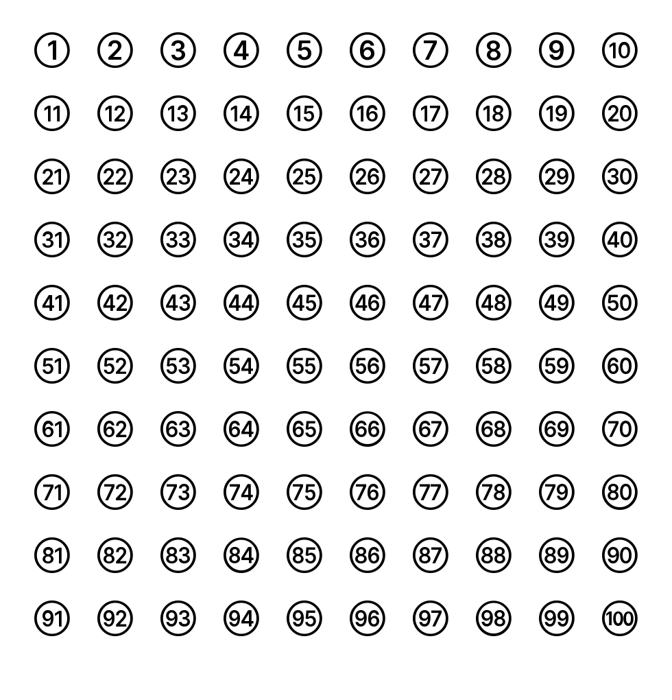

# Circled Numbers

An outlined-circle numeral font covering **1–100**. One glyph per number, all
the same advance width, TrueType outlines, no hinting dependencies.



## What's in `dist/`

| File | Use |
| --- | --- |
| `CircledNumbers-Regular.ttf` | Install this. Windows, macOS, Linux, label-printer software. |
| `CircledNumbers-Regular.woff2` | Web only (`@font-face`). |

Install on Windows: right-click the `.ttf` → **Install for all users**, then
restart the label software so it re-scans the font list.

## Four ways to get a circled number

Every number is reachable four different ways, so whichever pipeline you use,
one of them works.

**1. Just type the number** — needs an app that does OpenType shaping (Word,
InDesign, Illustrator, browsers, most modern label designers). Typing `42`
produces a single ㊷ glyph via the `liga`/`calt` features. Works for 1–100.

**2. One keystroke per number** — works everywhere, including dumb text
fields and raw byte streams. This is the label-printer path.

| Numbers | Type |
| --- | --- |
| 1–9 | `1` … `9` |
| 10 | `0` |
| 11–36 | `A` … `Z` |
| 37–62 | `a` … `z` |
| 63–100 | `À` … `å` (CP1252 bytes `0xC0`–`0xE5`) |

**3. Standard Unicode**, for 1–50 only — copy-paste safe, and these render in
other fonts too:
`U+2460`–`U+2473` (1–20), `U+3251`–`U+325F` (21–35), `U+32B1`–`U+32BF` (36–50).
Unicode has no circled numbers above 50, which is why the ranges stop there.

**4. Private Use Area**, uniform across the whole range: **`U+E000 + N`**.
So 7 is `U+E007`, 42 is `U+E02A`, 100 is `U+E064`. Use this when you want one
rule that covers 1–100 with no special cases.

`charmap.csv` lists all four columns for every number; regenerate it with
`python make_charmap.py`.

### The one gotcha

Because typing `1` gives ① and `2` gives ②, an app with ligatures **on** turns
`12` into ⑫ — that's the point. But it means you cannot type ① and ② next to
each other in such an app. Put a space between them, or address them by their
Unicode/PUA codepoints instead.

## Label-printer notes

- `fsType` is 0, so the font may be embedded in PDFs and downloaded to printers.
- TrueType (`glyf`) outlines, not CFF — the widest rasteriser support.
- All 100 glyphs share an advance of 880/1000 em, so columns line up without
  tabular-figure settings.
- A legacy `(1,0)` single-byte cmap subtable is included alongside the Windows
  Unicode one, for raw-byte pipelines (ZPL/EPL font download, older drivers).
- **Size floor:** on a 203 dpi thermal printer, use **12 pt or larger**. Below
  ~10 pt the two- and three-digit numerals start to fill in when thresholded to
  1-bit. Single digits stay readable a couple of points lower.
  `specimen-small-sizes.png` shows the 1-bit simulation from 8 pt up.

## Rebuilding

Requires `fonttools` and `brotli`. The numerals come from Inter, which is not
vendored here — pass any TTF/WOFF2 that has digits:

```
python build_circled_numbers.py --source path/to/Inter-SemiBold.woff2 \
                                --out dist/CircledNumbers-Regular.ttf
```

Design constants live at the top of `build_circled_numbers.py`: ring radius and
thickness, inner padding, and a per-digit-count fit table. The build measures
the real outlines and picks one scale per digit-count from the worst case in
that group, so every two-digit number is the same size as every other.

## License

SIL Open Font License 1.1 — see `OFL.txt`. The numerals are derived from
[Inter](https://github.com/rsms/inter) (Copyright 2020 The Inter Project
Authors, OFL 1.1), so this font is an OFL derivative and must stay under the
OFL. That permits commercial use, embedding, and redistribution; it does not
permit selling the font file on its own.
